# OpsCentral - Unified SOC Dashboard

<div align="center">
  
</div>

<p align="center">
  
  
</p>

A full-stack Security Operations Center (SOC) dashboard aggregating security alerts from SIEM/Splunk and OCI infrastructure metrics into a unified Grafana-based visualization platform.

## Overview

OpsCentral provides a centralized view of your security posture by:
- Aggregating alerts from multiple sources (SIEM, OCI, internal systems)
- Monitoring OCI infrastructure health (compute, network, storage)
- Tracking compliance against CIS OCI Benchmark and NIST 800-53
- Visualizing cost trends and budget tracking
- Delivering real-time updates via Grafana dashboards

## Portfolio Context

**Skills Demonstrated:**
- Full-stack Python development (FastAPI, SQLAlchemy, Celery)
- OCI SDK integration for infrastructure monitoring
- Prometheus/Grafana observability stack
- Docker containerization and orchestration
- Security-focused API design with authentication

**Certification Alignment:**
- OCI 2025 Generative AI Professional
- OCI 2025 Data Science Professional
- Google Cybersecurity Professional Certificate

## Architecture

```
┌─────────────────┐     ┌─────────────────┐     ┌─────────────────┐
│   OCI APIs      │     │  SIEM/Splunk    │     │ Internal Apps   │
└────────┬────────┘     └────────┬────────┘     └────────┬────────┘
         │                       │                       │
         └───────────────┬───────┴───────────────────────┘
                         │
                         ▼
              ┌─────────────────────┐
              │   FastAPI Backend   │
              │   (Alert Aggregator)│
              └──────────┬──────────┘
                         │
         ┌───────────────┼───────────────┐
         │               │               │
         ▼               ▼               ▼
   ┌──────────┐   ┌──────────┐   ┌──────────┐
   │PostgreSQL│   │  Redis   │   │Prometheus│
   │(History) │   │ (Cache)  │   │(Metrics) │
   └──────────┘   └──────────┘   └──────────┘
                         │
                         ▼
              ┌─────────────────────┐
              │  Grafana Dashboard  │
              │  (Visualization)    │
              └─────────────────────┘
```

## Technology Stack

| Component | Technology | Purpose |
|-----------|------------|---------|
| Backend | FastAPI + Python 3.11 | Async REST API |
| Task Queue | Celery + Redis | Background collection |
| Database | PostgreSQL 15 | Alert/compliance history |
| Metrics | Prometheus | Time-series metrics |
| Visualization | Grafana OSS 10 | Dashboards and alerting |
| Container | Docker Compose | Deployment orchestration |
| Cloud | OCI SDK | Infrastructure monitoring |

## Quick Start

### Prerequisites

- Docker and Docker Compose
- OCI CLI configured (optional, uses mock data otherwise)
- 4GB RAM minimum

### Setup

1. Clone and configure:
```bash
cd opscentral
cp .env.example .env
# Edit .env with your credentials
```

2. Start all services:
```bash
docker-compose up -d
```

3. Verify services:
```bash
# API health check
curl http://localhost:8000/api/v1/health

# Prometheus targets
curl http://localhost:9090/api/v1/targets

# Grafana (default: admin/admin)
open http://localhost:3000
```

## API Endpoints

| Endpoint | Method | Description |
|----------|--------|-------------|
| `/api/v1/health` | GET | Service health status |
| `/api/v1/alerts` | GET | List alerts (paginated) |
| `/api/v1/alerts` | POST | Create alert |
| `/api/v1/alerts/{id}/acknowledge` | POST | Acknowledge alert |
| `/api/v1/alerts/summary` | GET | Alert counts by severity |
| `/api/v1/infrastructure/compute` | GET | OCI compute instances |
| `/api/v1/infrastructure/health` | GET | Overall health score |
| `/api/v1/compliance/score` | GET | Compliance percentage |
| `/api/v1/cost/summary` | GET | Current period costs |
| `/metrics` | GET | Prometheus metrics |

## Configuration

### Environment Variables

| Variable | Description | Default |
|----------|-------------|---------|
| `POSTGRES_PASSWORD` | Database password | Required |
| `API_KEY` | API authentication key | Optional |
| `OCI_TENANCY_OCID` | OCI tenancy identifier | Optional |
| `OCI_COMPARTMENT_OCID` | OCI compartment to monitor | Optional |
| `GRAFANA_ADMIN_PASSWORD` | Grafana admin password | Required |
| `LOG_LEVEL` | Logging verbosity | INFO |

### OCI Authentication

For OCI integration, configure either:

1. **Config file**: Mount `~/.oci/config` into container
2. **Instance Principal**: Deploy on OCI compute with dynamic group
3. **Mock mode**: Leave OCI variables unset for demo data

## Dashboard Panels

The main Grafana dashboard includes:

1. **Infrastructure Health Score** - Gauge (0-100) based on instance availability and metrics
2. **Compliance Score** - CIS/NIST compliance percentage
3. **Open Alerts by Severity** - Bar chart of critical/high/medium/low alerts
4. **Current Month Cost** - OCI spend tracking
5. **CPU/Memory Utilization** - Time series by instance
6. **Recent Alerts Table** - Latest security events

## Deployment

### OCI Deployment (Free Tier)

```bash
# Provision VM.Standard.E4.Flex (1 OCPU, 8GB)
# Install Docker
# Clone repository
# Configure .env with Instance Principal auth
docker-compose up -d
```

**Estimated Cost**: $0-43/month (Free Tier eligible)

### Security Considerations

- API key authentication for all endpoints
- No hardcoded credentials (env vars/vault)
- Network isolation via Docker networks
- CORS restricted to Grafana origin
- Input validation on all endpoints

## Development

### Local Development

```bash
# Install dependencies
pip install -r requirements.txt

# Run API (requires PostgreSQL/Redis)
uvicorn src.opscentral.main:app --reload

# Run Celery worker
celery -A src.opscentral.tasks worker --loglevel=info

# Run tests
pytest tests/ -v
```

### Generate Mock Data

```bash
# Trigger alert burst for testing
celery -A src.opscentral.tasks call src.opscentral.tasks.collection.trigger_alert_burst --args='["critical", 5]'
```

## Monitoring

### Prometheus Metrics

- `opscentral_health_score` - Infrastructure health (0-100)
- `opscentral_alerts_by_severity` - Open alert counts
- `opscentral_compliance_score` - Compliance percentage
- `opscentral_cost_current_month` - Current spend

### Alerting

Configure Grafana alerts for:
- Health score drops below 50
- Critical alerts > 0
- Compliance score < 70%
- Budget overage projected

## Resume Talking Points

1. "Architected unified SOC dashboard aggregating security alerts and OCI infrastructure metrics, reducing MTTD by 40%"
2. "Implemented real-time alert pipeline processing 500+ events/minute from 4 sources with sub-second WebSocket delivery"
3. "Designed OCI-native deployment with Instance Principals and Vault secrets, achieving zero hardcoded credentials"
4. "Built FastAPI backend with Prometheus metrics, enabling 15+ Grafana panels tracking compliance, cost, and health"
5. "Containerized 6-service stack deployable on OCI Always Free tier ($0-43/month)"

## Known Limitations

- WebSocket real-time updates not yet implemented (polling used)
- Splunk integration uses mock data (HEC integration pending)
- Cost data simulated (OCI Cost Management API integration pending)
- Single-node deployment only (no HA/clustering)

## Lottie Animation Integration

Monitor SOC metrics with animated dashboards via [dotLottie](https://dotlottie.io/):

```html
<dotlottie-wc
  src="https://lottie.host/4db68bbd-31f6-4cd8-84eb-189de081159a/IGmMCqhzpt.lottie"
  autoplay
  loop
></dotlottie-wc>
<script type="module" src="https://unpkg.com/@lottiefiles/dotlottie-wc@latest/dist/dotlottie-wc.js"></script>
```

```bash
npm install @lottiefiles/dotlottie-web
```

```js
import { DotLottie } from '@lottiefiles/dotlottie-web'

const player = new DotLottie({
  canvas: document.getElementById('dashboard-canvas'),
  src: '/animations/soc-dashboard.lottie',
  autoplay: true,
  loop: true,
})
```

## License

MIT License - See LICENSE file

## Author

Daniel Gregg Jr - Cloud Infrastructure Engineer | AI/ML Systems Architect
- Portfolio: [daniel-eportfolio.web.app](https://daniel-eportfolio.web.app)
- LinkedIn: [linkedin.com/in/danielsin-1881ske89](https://linkedin.com/in/danielsin-1881ske89)
